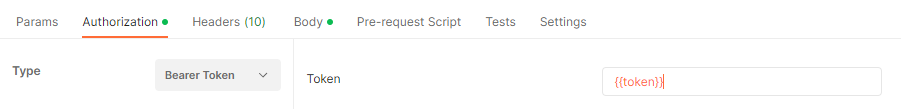

Este es un programa desarrollado en Python en conjunto con el framework Django.

A continuación encontraras la serie de pasos necesarios para su ejecución.

Descargamos el proyecto e ingresamos a la carpeta contenedora
```
git clone git@github.com:andycr00/test.git
cd test
```

Posterior a esto crearemos un entorno virtual en donde descargaremos las dependencias necesarias para su correcta ejecución.
Es necesario tener instalado tanto python como virtualenv

```
pip install virtualenv
python -m venv venv
cd venv/Scripts
activate
pip install -r requirements.txt
```

Este programa trabaja con una base de datos SQLite3 con el fin de hacer sencilla su ejecución. 
De esta forma debemos crear las tablas necesarias junto con los seeders para tener registros con los que trabajar

```
python manage.py migrate
python manage.py seed_data
```

Con la información ya integrada y el programa listo para comenzar, podemos correrlo y probarlo
```
python manage.py runserver
```

Ahora intentaremos ingresar al administrador de Django, en donde encontraremos el CRUD de las tablas de Client, Bill y Product respectivamente

```
http://localhost:8000/admin/
```

Aqui se nos redirigirá a la pantalla de inicio de sesión, con los seeders ejecutados, el super usuario registrado es

```
user: test
password: 123456
```

Una vez dentro, podemos hacer uso de las tablas y los registros que se encuentran por defecto allí.


En el apartado del API. encontramos diferentes servicios que podrán ser accesados al hacer uso de un JWT de autenticación. 


Este token puede ser obtenido consumiendo el siguiente servicio
```
method  POST

url  localhost:8000/api/token/

parameters/body 
- username: "test"
- password: "123456"
```

Esto retornara un objeto con dos atributos: access y refresh.

Para hacer uso de los servicios es necesario agregar el token otenido en "access" como una cabecera o header de la petición.

```
Authorization: Bearer < token >
```

O en postman en el apartado de Autohorization, usando Bearer Token.



Una vez hecho esto podemos usar los siguientes servicios:


_Creación de un usuario_

```
method  POST

url  localhost:8000/sales/users

parameters/body
- email: correo electronico
- password: contraseña
```

_Obtener clientes en un csv_
```
method  GET

URL  localhost:8000/sales/users_csv
```

Esta descarga del archivo no es posible hacerla desde postman, ya que muestra como response de la operación los registros en texto plano. 

Para el uso correcto del servicio se debe hacer una petición desde el navegador por medio de un script, o en caso tal comentar la autenticación para hacer su respectiva prueba. 

Podemos dirigirnos a:

```
prueba_quick\applications\sales\view\API\users_csv.py
```

Y comentar las lineas 20:23

De esta forma, al escribir en el navegador

```
localhost:8000/sales/users_csv
```

Podremos descargar directamente el archivo, que se vera algo asi:
